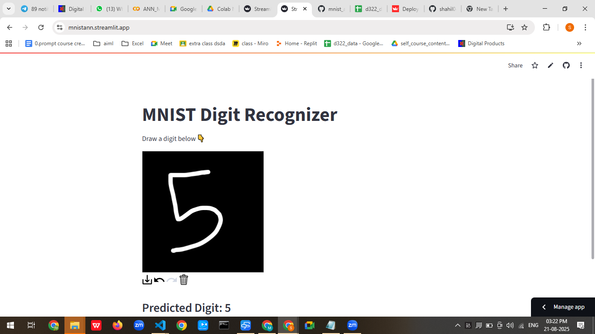

Here’s a **README.md** you can use for your MNIST Digit Recognizer project:

---

```markdown
# 🖌️ MNIST Digit Recognizer with Streamlit

An interactive web app to draw digits (0-9) on a canvas and predict them using a pre-trained Artificial Neural Network (ANN) trained on the MNIST dataset.  
Built with **Python**, **Streamlit**, **OpenCV**, **TensorFlow/Keras**, and **streamlit-drawable-canvas**.

---

## 📌 Features
- Draw digits on an interactive black canvas.
- Real-time preprocessing and prediction.
- Powered by a trained ANN model (`mnist_ann_model.h5`).
- Easy to run locally or deploy on **Streamlit Cloud**.

---

## 🖥️ Demo


*(Optional: Add a GIF or screenshot of your app)*

---

## 📂 Project Structure
```

mnist-digit-recognizer/
│
├── mnist\_ann\_model.h5        # Pre-trained ANN model
├── app.py                    # Streamlit app
├── requirements.txt          # Python dependencies
└── README.md                 # Project documentation

````

---

## ⚙️ Installation & Setup

### 1️⃣ Clone the Repository
```bash
git clone https://github.com/shahil04/mnist_ann_dl_project
cd mnist-digit-recognizer
````

### 2️⃣ Create a Virtual Environment (Optional but recommended)
- python3.13
```bash
python -m venv venv
source venv/bin/activate   # Mac/Linux
venv\Scripts\activate      # Windows
```

### 3️⃣ Install Dependencies

```bash
pip install -r requirements.txt
```

### 4️⃣ Run the App

```bash
streamlit run app.py
streamlit run mnist.app.py

```

---

## 🧠 Model Information

* **Dataset:** [MNIST Handwritten Digits](http://yann.lecun.com/exdb/mnist/)
* **Model Type:** ANN (Artificial Neural Network)
* **Input Shape:** 784 features (flattened 28x28 image)
* **Output:** Probability distribution over 10 classes (digits 0–9)

---

## 📦 requirements.txt

Example `requirements.txt`:

```
streamlit
opencv-python-headless
tensorflow
numpy
pillow
streamlit-drawable-canvas
```

---

## 🛠️ How It Works

1. User draws a digit on the canvas.
2. The drawing is captured as an image (`RGBA`).
3. Image is converted to grayscale and resized to **28x28** pixels.
4. Image is normalized (`0-1` range) and flattened to a 1D array of **784** features.
5. ANN model predicts the digit.
6. Predicted digit is displayed on the UI.

---

## 🚀 Deployment

You can deploy the app to **Streamlit Cloud**:

1. Push your project to GitHub.
2. Go to [Streamlit Cloud](https://streamlit.io/cloud) and link your repository.
3. Select `app.py` as the entry file.
4. Deploy 🚀

---

## 📜 License

This project is licensed under the MIT License - see the [LICENSE](LICENSE) file for details.

---

## ✨ Author

**Your Name**
[GitHub](https://github.com/shahil04) | [LinkedIn](https://in.linkedin.com/in/md-shahil-ai)

```

---

Do you want me to also **add training code for `mnist_ann_model.h5`** in this README so others can retrain the model if they want? That will make it fully reproducible.
```
